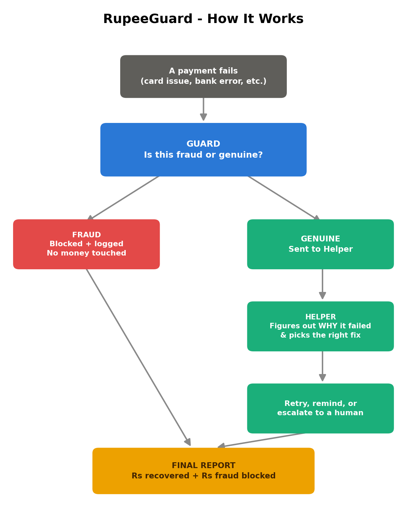
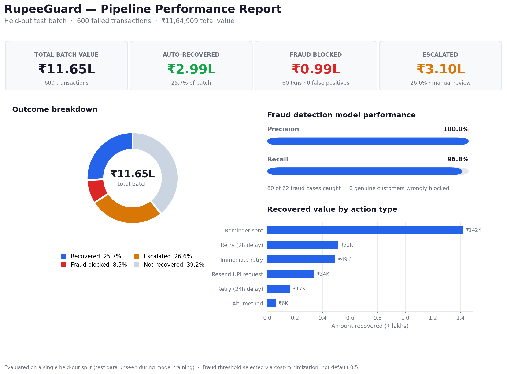

# RupeeGuard

**A dual-purpose AI system for payment fraud detection and revenue recovery.**


---

## Overview

Every failed online payment falls into one of two categories: a fraud attempt, or a legitimate transaction that failed for an ordinary reason — an expired card, a slow bank server, a mistyped OTP. Treating these two cases identically is costly in both directions: chasing fraudulent transactions wastes effort and creates risk, while failing to recover genuine transactions leaves real revenue on the table.

RupeeGuard addresses both problems with a single connected pipeline:

1. **A fraud detection layer** ("the Guard") screens every failed transaction and blocks the ones it identifies as fraudulent, with a documented precision/recall trade-off and full explainability.
2. **A recovery layer** ("the Helper") takes every transaction the Guard clears as genuine, diagnoses the root cause of the failure, and executes an appropriate, rate-limited recovery action — automated where possible, escalated to a human where not.

Fraud is filtered out before any recovery effort is spent on it, and recovery decisions are driven by the specific failure cause rather than a uniform retry policy.

<p align="center">
  
</p>

---

## Results

Evaluated on a held-out test set of 600 failed transactions (₹11.65L total value) that the fraud model had not seen during training:

<p align="center">
  
</p>

| Metric | Value |
|---|---|
| Fraud detection precision | 100% (0 false positives) |
| Fraud detection recall | 96.8% (60/62 fraud cases caught) |
| Automated recovery rate | 25.7% of total batch value (₹2,98,951) |
| Escalated to manual review | 26.6% (₹3,10,284) |
| Residual risk (fraud that bypassed both layers) | 0.06% (₹733) |

Full metrics, threshold selection methodology, and confusion matrices are documented in the notebook.

---

## How it works

### Fraud detection (the Guard)

An XGBoost classifier trained on transaction-level features, including a device fan-out signal (number of distinct customers sharing a device — a common fraud-ring indicator) and transaction velocity (attempts per hour).

- Class imbalance (fraud ≈ 2.5% of transactions) is handled via `scale_pos_weight` rather than naive resampling.
- The classification threshold is not the default 0.5. It is selected by minimizing total expected cost, where the cost of a false negative is the actual transaction amount and the cost of a false positive is a fixed customer-friction estimate — a cost-sensitive decision policy rather than a purely statistical one.
- Every flagged transaction is paired with a SHAP-based explanation identifying which features drove the decision, rather than an opaque score.

### Recovery (the Helper)

For transactions the Guard clears as genuine, a recovery action is selected based on the specific failure reason (e.g. `insufficient_funds` → delayed retry, `bank_technical_error` → immediate retry, `emi_not_supported` → alternate payment method suggestion). This mapping is also exposed to an LLM-based agent (Gemini), which incorporates additional context — such as prior attempt count — that a static lookup table cannot.

A hard rate limit is enforced: transactions with four or more recent failed attempts are escalated to manual review rather than receiving further automated contact. Every decision, whether rule-based or LLM-generated, is written to an audit log with a timestamp and rationale.

---

## Repository structure

```
rupeeguard/
├── README.md
├── notebooks/
│   └── RupeeGuard.ipynb        # end-to-end pipeline
├── images/
│   ├── architecture_diagram.png
│   └── final_report_chart.png
└── data/
    └── recovery_audit_trail.csv   # sample decision log output
```

## Live demo

An interactive Streamlit app (`streamlit_app.py`) is included, combining the performance dashboard with a live transaction tester — enter a transaction's details and see the Guard/Helper decision in real time. Deployable for free on [Streamlit Community Cloud](https://streamlit.io/cloud) by connecting this repository.

## Getting started

1. Open `notebooks/RupeeGuard.ipynb` in [Google Colab](https://colab.research.google.com/) or a local Jupyter environment.
2. Run cells sequentially — the notebook generates its own synthetic dataset, so no external data is required.
3. The recovery agent step requires a free Gemini API key from [Google AI Studio](https://aistudio.google.com) (no billing setup needed on the free tier).

## Tech stack

Python, Pandas, scikit-learn, XGBoost, SHAP, Google Gemini API, Matplotlib.

---

## Data

No production data was available for this project, so a synthetic dataset was generated (20,000 transactions) using Razorpay's public Payments API schema — field names, ID formats, and error taxonomy (`error_code`, `error_reason`, `error_source`) match their documented API structure, so the pipeline's input/output shape is consistent with a real integration target.

## Design decisions and known limitations

- Recovery action success rates (e.g. "immediate retry succeeds 65% of the time") are documented assumptions used for simulation, not calibrated historical data. A production deployment would replace these with rates learned from outcome logs.
- The false-positive cost used in threshold selection (₹50 per wrongly-blocked transaction) is an estimate; the actual cost would depend on measured customer churn and support load.
- The fraud model is evaluated only on a single held-out split; a production system would use time-based validation to account for concept drift, since fraud patterns evolve.
- The LLM-based recovery agent is demonstrated on a sample of transactions rather than the full batch, due to free-tier API rate limits. The rule-based path is used for full-batch throughput, with the LLM agent available as a higher-reasoning option for ambiguous cases.

## License

MIT
